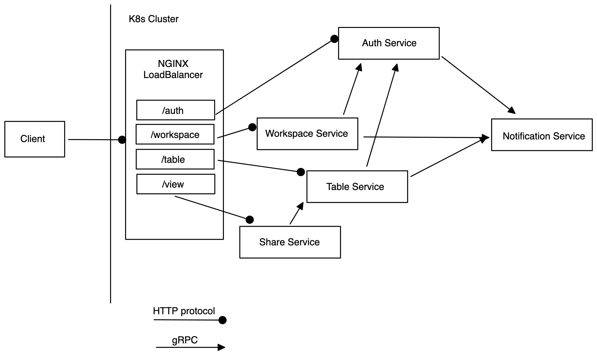
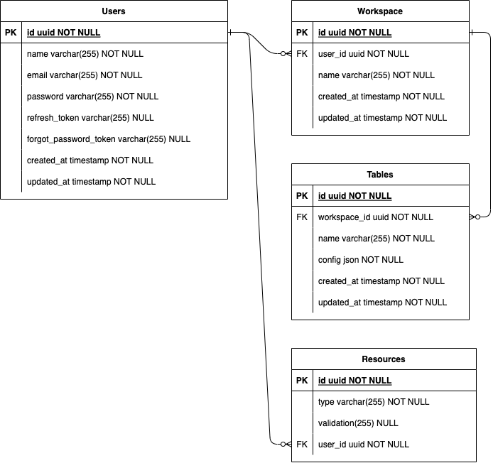

# Airtable

## Opis

Alat sluzi za kreiranje pregleda podataka prema korisnicki definiranom modelu. U nastavku su opisane funkcionalnosti implementirane na backend dijelu kroz Go programski jezik.

## Servisi

Backend aplikacija se sastoji od 5 zasebnih servisa:
- Auth
- Workspace
- Table
- Share
- Notification
Servisi su kreirani kao Docker image te deployani u K8s cluster. Pristup servisima kontrolira se putem NGINX load balancera koji usmjerava promet prema path endpoint pravilima na određeni servis.

Auth servis služi za registraciju i login korisnika te sve popratne servise za resetiranje lozinke i dohvat korisničkih podataka.

Workspace servis se sastoji od CRUD operacija za workspace objekt.
Table servis se sastoji od CRUD operacija za table objekt te je povezan na parent resurs - u ovom slučaju workspace (1..N). Table servis je odgovoran za spremanje i vraćanje dinamicki generiranih struktura. Strukture se spremaju u JSON formatu u bazu podataka.

Share servis služi za pohranu viewova odnosno resursa (tablica) koje su označene kao public te su dostupne putem share linka korisnicima koji ne moraju nužno biti registrirani.

Notification servis služi za slanje email obavijesti korisnicima te je implementiran na način da se koristi SendGrid API za slanje emailova.

## Arhitektura K8s Clustera

Arhitektura i poveznice između servisa i klijenta su prikazane na slici 1.

[Slika 1.](components.png)
  
## E-R diagram

Relacije u bazi podataka nisu izvedene pomoću stranih ključeva obzirom da je svaki od resursa u bazi podataka u zasebnom mikroservisu koji komunicira jedino sa svojom instancom baze podataka. Međutim arhitektura i logika aplikacije zadovoljava sljedeći E-R diagram:

